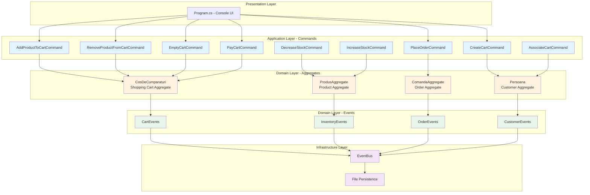
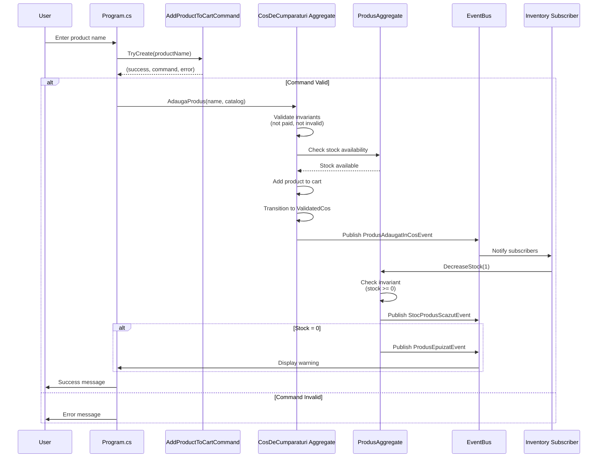
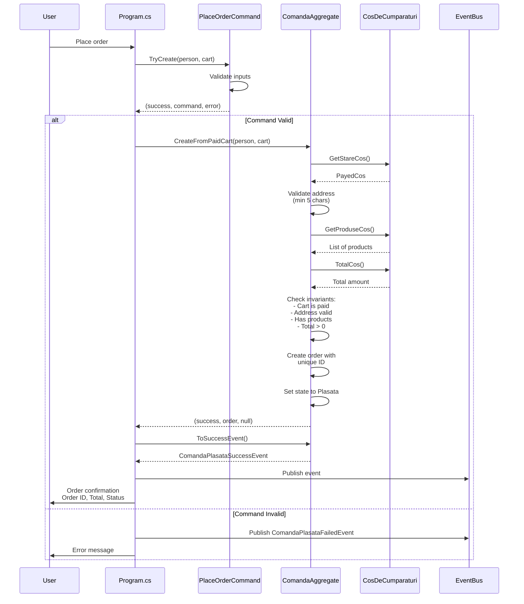
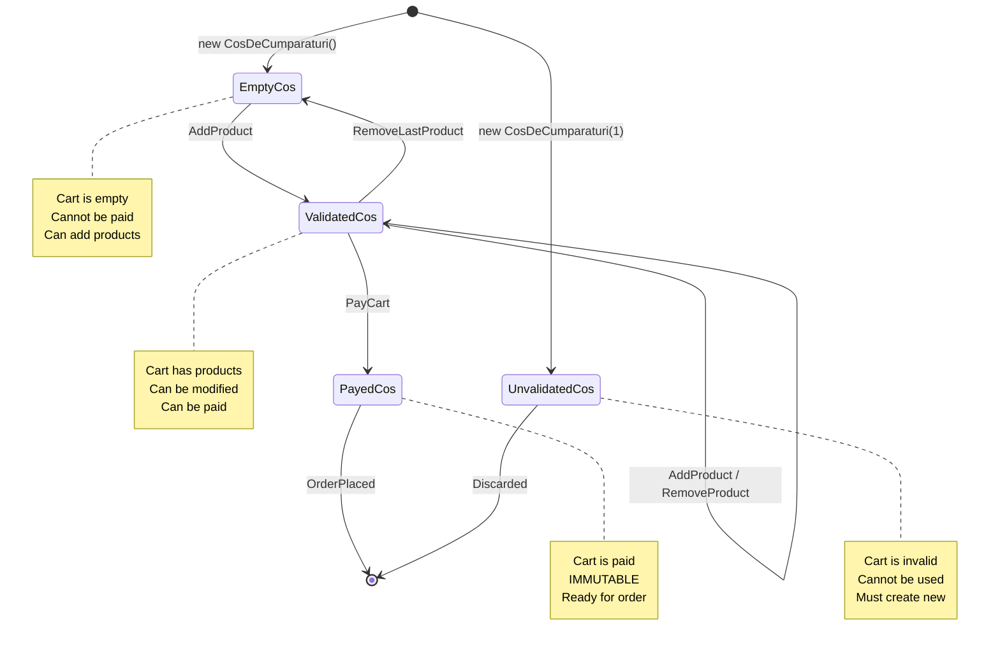
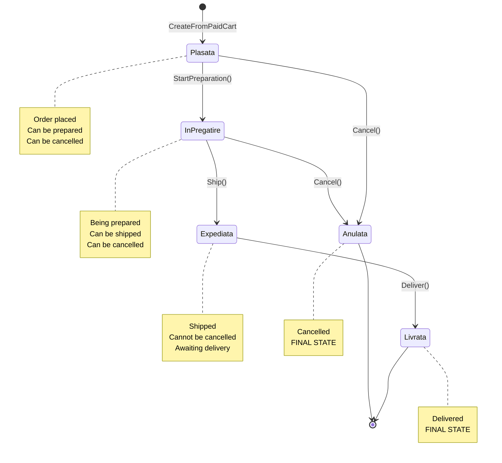
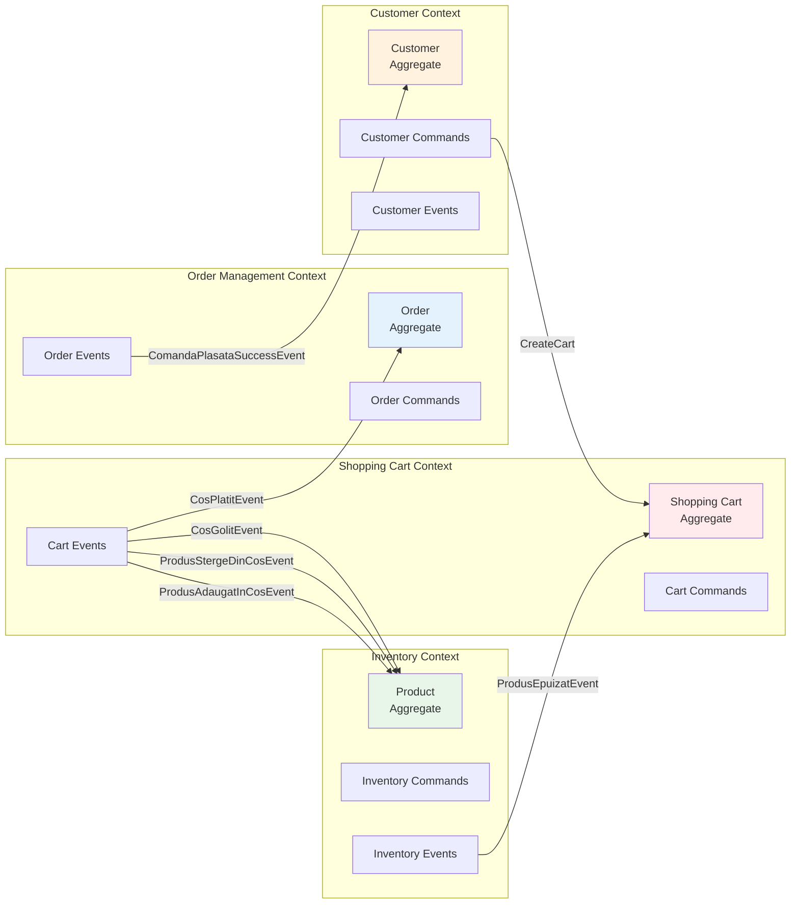
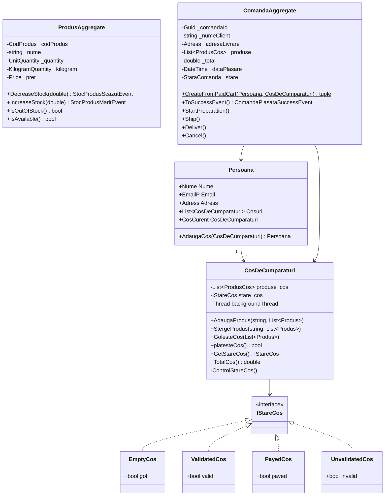
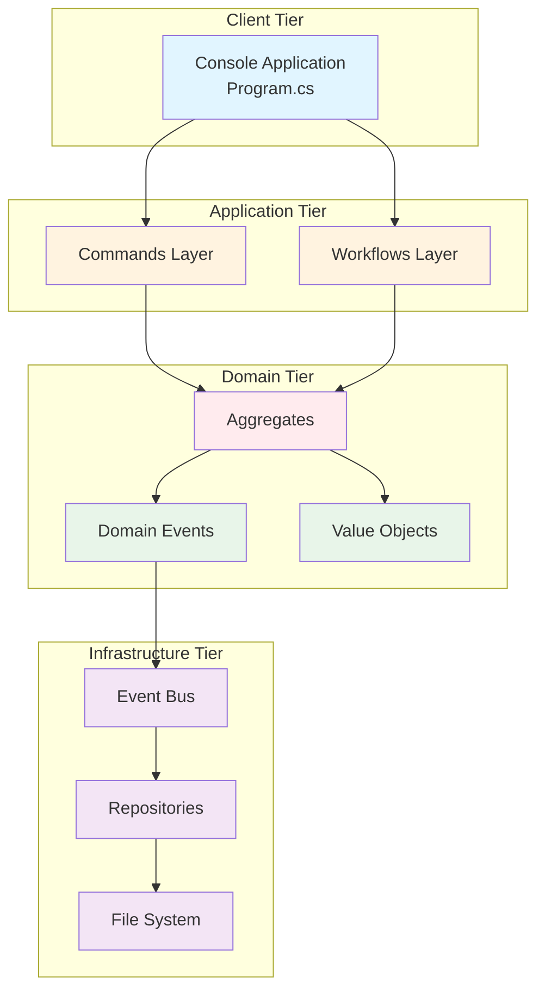
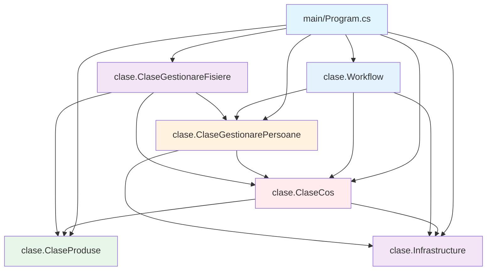

# Visual Architecture Diagrams

## Complete DDD Architecture

---

## Command Flow Example: Add Product to Cart

---

## Order Placement Flow

---

## State Transitions: Shopping Cart

---

## State Transitions: Order

---

## Bounded Context Map

---

## Event Flow Timeline

```mermaid
gantt
    title Order Placement Timeline
    dateFormat HH:mm:ss
    
    section User Actions
    Create Cart           :a1, 00:00:00, 1s
    Add Product 1         :a2, 00:00:01, 1s
    Add Product 2         :a3, 00:00:02, 1s
    Pay Cart              :a4, 00:00:05, 1s
    Place Order           :a5, 00:00:07, 1s
    
    section Cart Events
    CosCreatEvent         :e1, 00:00:00, 1s
    ProdusAdaugat 1       :e2, 00:00:01, 1s
    ProdusAdaugat 2       :e3, 00:00:02, 1s
    CosValidatEvent       :e4, 00:00:02, 1s
    CosPlatitEvent        :e5, 00:00:05, 1s
    
    section Inventory Events
    StocScazut Product 1  :i1, 00:00:01, 1s
    StocScazut Product 2  :i2, 00:00:02, 1s
    
    section Order Events
    OrderReady            :o1, 00:00:05, 1s
    OrderPlaced           :o2, 00:00:07, 1s
```

---

## Class Diagram: Key Aggregates

---

## Deployment View

---

## Package Dependencies

---

These diagrams provide a complete visual representation of your DDD architecture! ??
