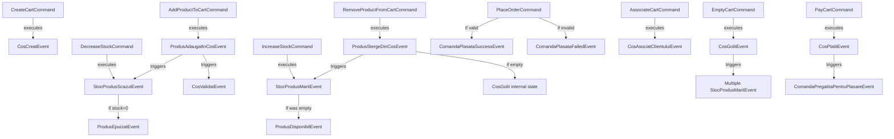

# Complete Command-Event-Aggregate Mapping

## Shopping Cart Context Commands & Events

### 1. CreateCartCommand
- **Triggers**: `CosCreatEvent`
- **Aggregate**: `CosDeCumparaturi`, `Persoana`
- **Business Rules**:
  - Customer name cannot be empty
  - Customer must exist in system
  - New cart initializes with `EmptyCos` state
- **Invariants**:
  - New cart is always empty
  - Cart must be associated with existing customer
  - Customer can have multiple carts in history

**Implementation**:
```csharp
var (success, command, error) = CreateCartCommand.TryCreate(numePersoana);
if (success)
{
    var cos = new CosDeCumparaturi();
    var event = new CartEvents.CosCreatEvent(numePersoana, DateTime.UtcNow);
    EventBus.Publish(event);
}
```

---

### 2. AddProductToCartCommand
- **Triggers**: `ProdusAdaugatInCosEvent` ? `StocProdusScazutEvent`
- **Aggregate**: `CosDeCumparaturi`
- **Business Rules**:
  - Product name cannot be empty
  - Cart cannot be in `PayedCos` or `UnvalidatedCos` state
  - Product must exist in catalog
  - Product stock must be > 0
- **Invariants**:
  - Stock decreases atomically with cart addition
  - Non-empty cart transitions to `ValidatedCos`
  - Paid carts are immutable

**Implementation**:
```csharp
var (success, command, error) = AddProductToCartCommand.TryCreate(numeProdus);
if (success)
{
    cos.AdaugaProdus(numeProdus, produse);
    // Event published internally
}
```

---

### 3. RemoveProductFromCartCommand
- **Triggers**: `ProdusStergeDinCosEvent` ? `StocProdusMaritEvent`
- **Aggregate**: `CosDeCumparaturi`
- **Business Rules**:
  - Product name cannot be empty
  - Cart cannot be in `PayedCos` or `UnvalidatedCos` state
  - Product must exist in cart
- **Invariants**:
  - Stock increases atomically with cart removal
  - Empty cart transitions to `EmptyCos`
  - Paid carts are immutable

---

### 4. EmptyCartCommand
- **Triggers**: `CosGolitEvent` ? Multiple `StocProdusMaritEvent`
- **Aggregate**: `CosDeCumparaturi`
- **Business Rules**:
  - Cart cannot be in `PayedCos`, `UnvalidatedCos`, or `EmptyCos` state
- **Invariants**:
  - All products returned to stock atomically
  - Cart transitions to `EmptyCos`
  - No modifications allowed after emptying until new product added

---

### 5. PayCartCommand
- **Triggers**: `CosPlatitEvent` ? `ComandaPregatitaPentruPlasareEvent`
- **Aggregate**: `CosDeCumparaturi`
- **Business Rules**:
  - Cart cannot already be paid
  - Cart cannot be in `UnvalidatedCos` state
  - Cart cannot be empty
  - Cart must be in `ValidatedCos` state
- **Invariants**:
  - Payment is final and irreversible
  - Paid cart becomes read-only
  - Background thread stops after payment

---

## Inventory Context Commands & Events

### 6. DecreaseStockCommand
- **Triggers**: `StocProdusScazutEvent` ? (potentially) `ProdusEpuizatEvent`
- **Aggregate**: `ProdusAggregate`
- **Business Rules**:
  - Product code must be positive
  - Quantity must be positive
  - Sufficient stock must be available
- **Invariants**:
  - Stock cannot be negative
  - Decrementation is atomic
  - If stock reaches 0, `ProdusEpuizatEvent` triggered

**Implementation**:
```csharp
var product = ProdusAggregate.Create(codProdus, nume, quantity, kilogram, price);
var decreaseEvent = product.DecreaseStock(1);
EventBus.Publish(decreaseEvent);

if (product.IsOutOfStock())
{
    var outOfStockEvent = new InventoryEvents.ProdusEpuizatEvent(
        product.CodProdus.Cod,
        product.Nume,
        DateTime.UtcNow
    );
    EventBus.Publish(outOfStockEvent);
}
```

---

### 7. IncreaseStockCommand
- **Triggers**: `StocProdusMaritEvent` ? (potentially) `ProdusDisponibilEvent`
- **Aggregate**: `ProdusAggregate`
- **Business Rules**:
  - Product code must be positive
  - Quantity must be positive
- **Invariants**:
  - Stock increases atomically
  - If product was out of stock, `ProdusDisponibilEvent` triggered

---

## Order Management Context Commands & Events

### 8. PlaceOrderCommand
- **Triggers**: `ComandaPlasataSuccessEvent` OR `ComandaPlasataFailedEvent`
- **Aggregate**: `ComandaAggregate` (Saga/Process Manager)
- **Business Rules**:
  - Person must exist
  - Cart must exist and be valid
  - Cart must be in `PayedCos` state
  - Delivery address must be valid (min 5 characters)
  - Cart must contain at least one product
- **Invariants**:
  - Order only created from paid carts
  - Once placed, order cannot be cancelled (in current implementation)
  - Address validated before placement
  - Order total is immutable
  - Order products are immutable

**Implementation**:
```csharp
var (success, order, error) = ComandaAggregate.CreateFromPaidCart(persoana, cos);

if (success)
{
    var successEvent = order.ToSuccessEvent();
    EventBus.Publish(successEvent);
    Console.WriteLine(successEvent.Message);
}
else
{
    var failedEvent = new ComandaEvent.ComandaPlasataFailedEvent(error);
    Console.WriteLine(failedEvent.Message);
}
```

---

## Customer Context Commands & Events

### 9. AssociateCartToCustomerCommand
- **Triggers**: `CosAsociatClientuluiEvent`
- **Aggregate**: `Persoana`
- **Business Rules**:
  - Customer name cannot be empty
  - Cart must be valid
  - Customer must exist in system
- **Invariants**:
  - Customer can have multiple carts (history)
  - Current cart is always the last cart added
  - Old carts are read-only

**Implementation**:
```csharp
var (success, command, error) = AssociateCartToCustomerCommand.TryCreate(numeClient, cos);
if (success)
{
    var updatedPersoana = persoana.AdaugaCos(cos);
    var event = new CustomerEvents.CosAsociatClientuluiEvent(
        numeClient,
        updatedPersoana.Cosuri.Count - 1,
        DateTime.UtcNow
    );
    EventBus.Publish(event);
}
```

---

## Aggregate Invariants Summary

### CosDeCumparaturi (Shopping Cart)
1. ? Paid cart cannot be modified (immutable after payment)
2. ? Cart state reflects content (Empty/Validated/Payed)
3. ? Stock modifications are atomic with cart operations
4. ? Empty cart cannot be paid
5. ? Invalid cart cannot be used

### ProdusAggregate (Product)
1. ? Stock cannot be negative
2. ? Price must be positive
3. ? Product code is unique and immutable
4. ? Stock operations are atomic

### Persoana (Customer)
1. ? Customer must have valid name
2. ? Email address must be valid
3. ? Current cart is most recent
4. ? Old carts cannot be modified

### ComandaAggregate (Order)
1. ? Order created only from paid carts
2. ? Delivery address must be validated
3. ? Order total is immutable
4. ? Order products cannot be modified after placement
5. ? Order state transitions follow business rules

---

## Event Flow Complete Diagram



---

## Usage in Program.cs

### Example: Creating Cart with Commands

**Before (Current)**:
```csharp
cos = new CosDeCumparaturi();
persoane[persoane.IndexOf(persoana)] = persoana.AdaugaCos(cos);
```

**After (With Commands)**:
```csharp
var (success, command, error) = CreateCartCommand.TryCreate(numePersoana);
if (success)
{
    cos = new CosDeCumparaturi();
    var updatedPersoana = persoana.AdaugaCos(cos);
    persoane[persoane.IndexOf(persoana)] = updatedPersoana;
    
    // Publish event
    EventBus.Publish(new CartEvents.CosCreatEvent(numePersoana, DateTime.UtcNow));
    Console.WriteLine("Cos creat cu succes");
}
else
{
    Console.WriteLine($"Error: {error}");
}
```

### Example: Placing Order with Aggregate

**Before (Current)**:
```csharp
var eventres = PlasareComandaWorkflow.PlaseazaComanda(persoanaComanda, persoanaComanda.CosCurent);
```

**After (With Aggregate)**:
```csharp
var (success, order, error) = ComandaAggregate.CreateFromPaidCart(
    persoanaComanda, 
    persoanaComanda.CosCurent
);

if (success)
{
    var successEvent = order.ToSuccessEvent();
    Console.WriteLine(successEvent.Message);
    Console.WriteLine($"Order ID: {order.ComandaId}");
    Console.WriteLine($"Total: {order.Total} lei");
}
else
{
    var failedEvent = new ComandaEvent.ComandaPlasataFailedEvent(error);
    Console.WriteLine(failedEvent.Message);
}
```

---

## Files Created

### Commands
- ? `Lucrarea1PSSC\clase\ClaseCos\Commands\CreateCartCommand.cs`
- ? `Lucrarea1PSSC\clase\ClaseCos\Commands\AddProductToCartCommand.cs`
- ? `Lucrarea1PSSC\clase\ClaseCos\Commands\RemoveProductFromCartCommand.cs`
- ? `Lucrarea1PSSC\clase\ClaseCos\Commands\EmptyCartCommand.cs`
- ? `Lucrarea1PSSC\clase\ClaseCos\Commands\PayCartCommand.cs`
- ? `Lucrarea1PSSC\clase\ClaseProduse\Commands\DecreaseStockCommand.cs`
- ? `Lucrarea1PSSC\clase\ClaseProduse\Commands\IncreaseStockCommand.cs`
- ? `Lucrarea1PSSC\clase\Workflow\Commands\PlaceOrderCommand.cs`
- ? `Lucrarea1PSSC\clase\ClaseGestionarePersoane\Commands\AssociateCartToCustomerCommand.cs`

### Aggregates
- ? `Lucrarea1PSSC\clase\ClaseProduse\ProdusAggregate.cs`
- ? `Lucrarea1PSSC\clase\Workflow\ComandaAggregate.cs`

### Events (Already Created)
- ? `Lucrarea1PSSC\clase\ClaseCos\CartEvents.cs`
- ? `Lucrarea1PSSC\clase\ClaseProduse\InventoryEvents.cs`
- ? `Lucrarea1PSSC\clase\Workflow\OrderEvents.cs`
- ? `Lucrarea1PSSC\clase\ClaseGestionarePersoane\CustomerEvents.cs`
- ? `Lucrarea1PSSC\clase\ClaseGestionareFisiere\PersistenceEvents.cs`

### Infrastructure
- ? `Lucrarea1PSSC\clase\Infrastructure\EventBus.cs`

### Documentation
- ? `Lucrarea1PSSC\DDD_ARCHITECTURE.md`

---

## Build Status
? **Build Successful** - All files compile without errors!

---

## Next Steps for Integration

1. **Update Program.cs** to use Commands instead of direct method calls
2. **Set up EventBus subscriptions** for cross-context communication
3. **Add logging** for domain events
4. **Create unit tests** for commands and aggregates
5. **Implement event store** for audit trail
6. **Add domain exceptions** for better error handling
7. **Create repository pattern** for aggregate persistence
8. **Implement CQRS** with separate read models

The complete DDD architecture is now in place! ??
