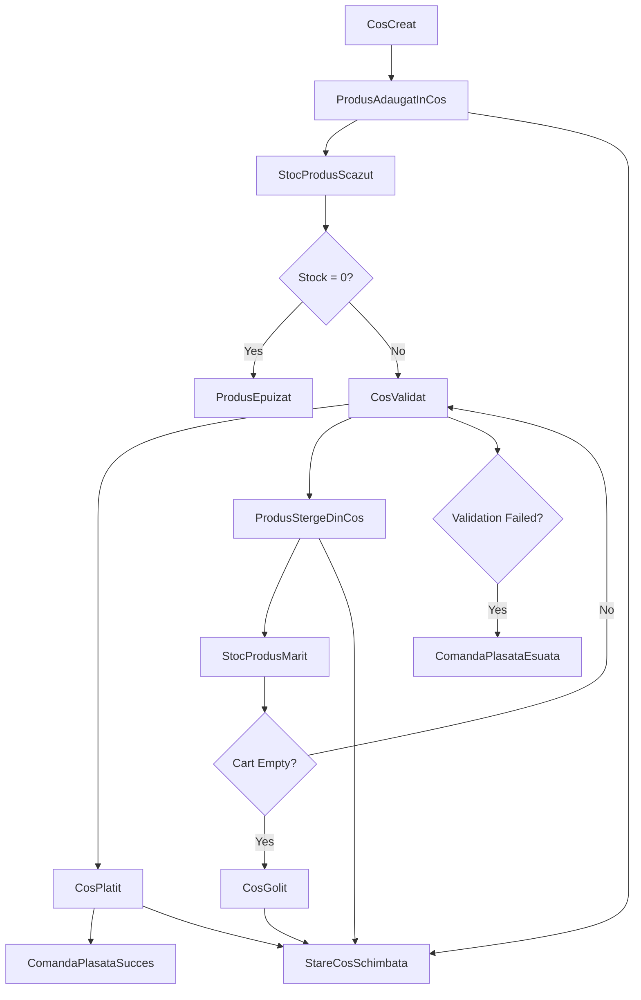

```mermaid
graph TD
    A[CosCreat] --> B[ProdusAdaugatInCos]
    B --> C[StocProdusScazut]
    C --> D{Stock = 0?}
    D -->|Yes| E[ProdusEpuizat]
    D -->|No| F[CosValidat]
    
    F --> G[CosPlatit]
    G --> H[ComandaPlasataSucces]
    
    F --> I[ProdusStergeDinCos]
    I --> J[StocProdusMarit]
    J --> K{Cart Empty?}
    K -->|Yes| L[CosGolit]
    K -->|No| F
    
    F --> M{Validation Failed?}
    M -->|Yes| N[ComandaPlasataEsuata]
    
    B --> O[StareCosSchimbata]
    I --> O
    G --> O
    L --> O
```